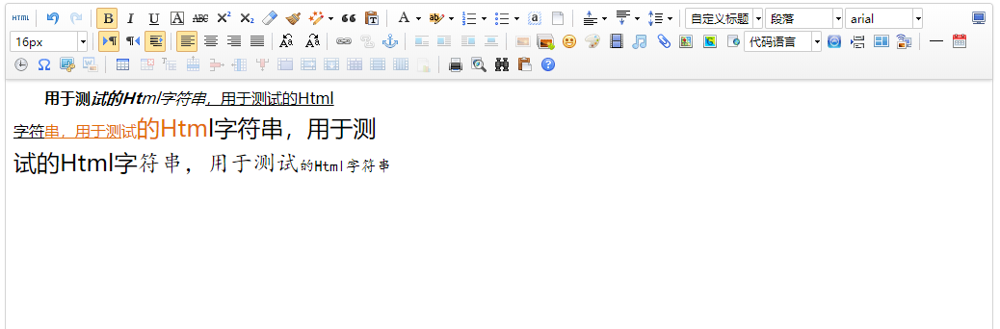
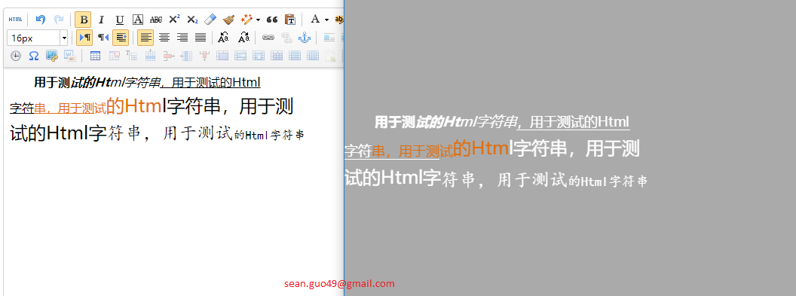
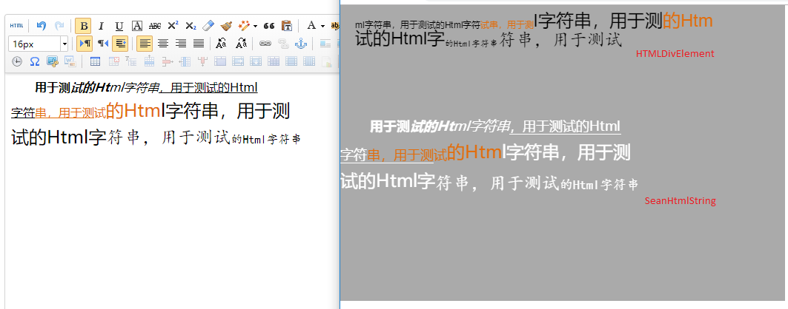
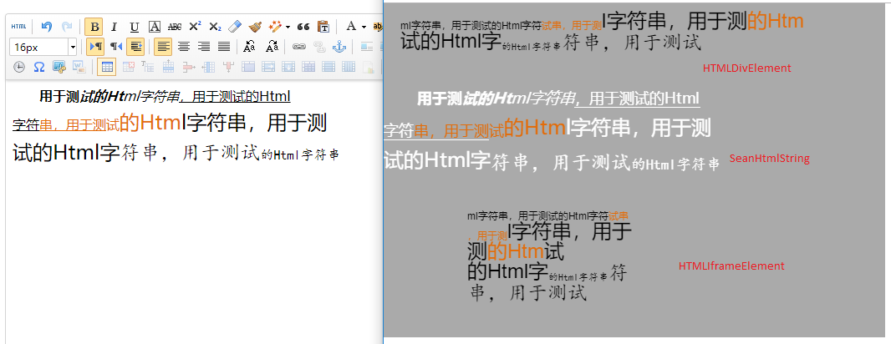

# htmltools
基于layaair H5引擎，开发的Html标签读取及解析封装。

使用LayaAir进行H5游戏开发的过程中，发现引擎自带的几个Html组件均无法满足游戏中的使用。

正好本人H5游戏中需要有带Html标签的跑马灯内容，于是对此进行了一个简单的封装。

<h1>示例效果：</h1>

<h3>ueditor编辑原文件内容：</h3>


<h3>本工具生成内容对比：</h3>


<h3>与LayaAir引擎自带HTMLDivElement组件对比：</h3>


<h3>与LayaAir引擎自带HTMLIframeElement组件对比：</h3>



<h1>使用方法：</h1>

```ts
	/*构造并添加到场景
	* htmlContent --- 需要显示的带有html标签的内容文本
	* confSrc     --- 本工具的配置文件路径
	*/
	public initSean(htmlContent:string,confSrc:string):void
	{
		var html_msg = new SeanHtmlString(htmlContent,confSrc);
		html_msg.pos(0,100);

		Laya.stage.addChild(html_msg);
	}
```


<h1>其他：</h1>

无私分享，不足之处，请轻砸。

sean.guo49@gmail.com

